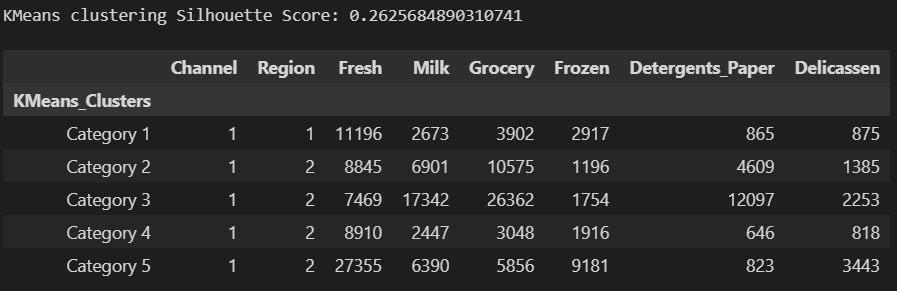
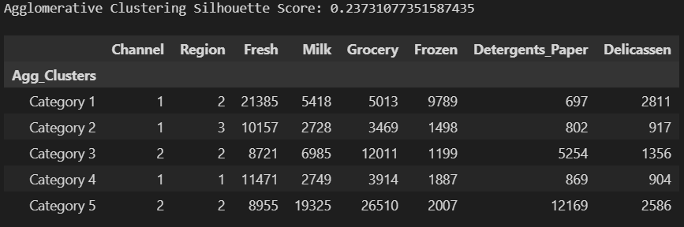
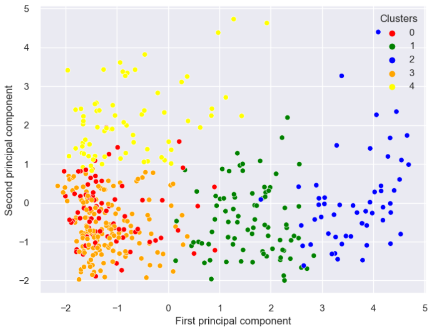
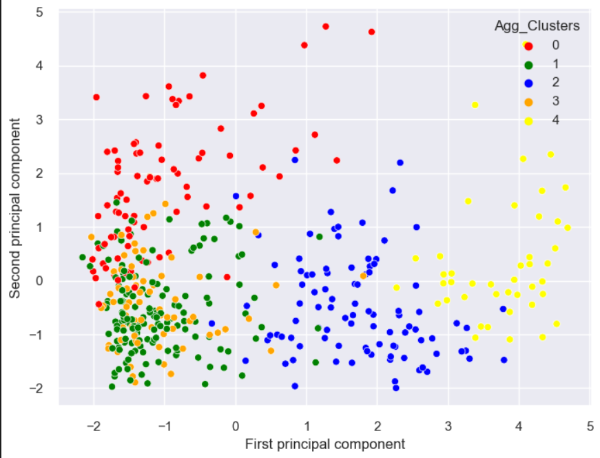
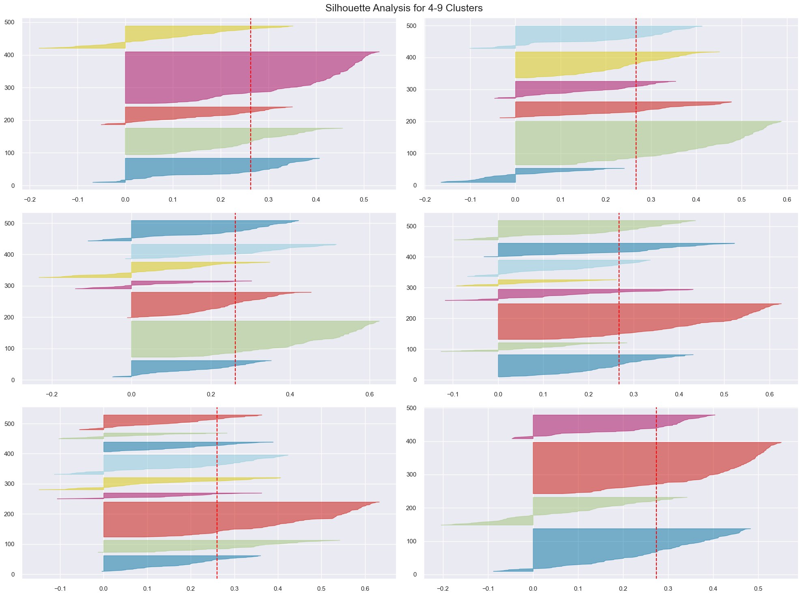
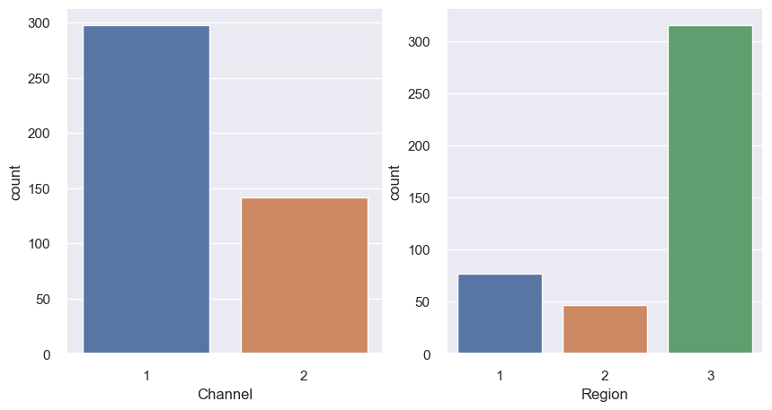

# Machine_learning_project-unsupervised-learning

## Project/Goals

The goal of the project is to perform a full unsupervised learning machine learning project on on a "Wholesale Data" dataset. The dataset refers to clients of a wholesale distributor. It includes the annual spending in monetary units (m.u.) on diverse product categories. [Kaggle Dataset](https://www.kaggle.com/datasets/binovi/wholesale-customers-data-set)

## Processing

This is a segmentation or clustering problem. The KMeans algorithm, Hierarchical Clustering algorithm (Agglomerative Clustering technique) and Principal Component Analysis will be used to predict clusters of the customers and their annual spendings.

### The data was explored and cleaned it from inappropriate values. All the variables are numerical values but two of them are categorical features and not numerical features (`[Channel]` and `[Region]`). Observations are as follows:

1. Graphs and statistical analysis was done as all the columns were of the numerical datatype. Histogram plots were used to observe the distribution of the data. The numerical features did not follow the Gaussian distribution. They were normalized using the `[MinMaxScaler]` function.

2. Bar plots were used to observe the distribution of the categorical features.

3. Box plots were further used to visualize all the outliers of the numerical features. The outliers were not removed because the dataset is quite small. I instead clipped them using the quartiles. This was also to ensure that the models had reasonable data to be trained on. Pair plot was used to observe possible correlations and the linear relationships between the features.

4. The features were first normalized using the `MinMaxScaler` function. after which they were standardized using the `StandardScaler` function.

## Results
- The number of clusters used for model training was $k=5$. This means the consumers/customers/spenders were split into five segments (clusters).
- The silhoutte score for the KMeans and Agglomerative Clustering (Hierarchical Clustering) algorithms were quite low. This means that many of the clusters were overlapping. During the model training and evaluation, this was also observed. It is most likely due to the small size of the dataset. There seems to be some agreement between the segmented clusters for both the KMeans and Agglomerative Clustering algorithms.
- The final customers segementation predicted by the KMeans clustering algorithm is presented in the table:

- The final customers segementation predicted by the Agglomerative Clustering algorithm is presented in the table:

- The predicted clusters for the KMeans trained model is displayed in the plot:

- The predicted clusters for the Agglomerative Clustering trained model is displayed in the plot:

### Key takeaways
- It was difficult to determine the optimal number of clusters for the KMeans and Agglomerative Clustering models. This can be observed from the silhoutte analysis for different number of clusters ($k\in[4,10)$)

- It is difficult to decide on which model predictions to recommend. But looking at the silhoutte's scores, I will recommend the predicted clusters from the KMeans clustering algorithm.

> I will recommend this with caution especially as there is a possibility that the KMeans clustering algorithm was biased in favor of `[Channel 1]`. This might also not be the case, because although `[Region 3]` has the highest count, the KMeans clustering algorithm didn't include it in any of the clusters (which is also a point of worry). On the other hand, the Agglomerative Clustering algorithm predicted clusters that were quite representative of the categorical features distribution

## Challenges 
 - Spent a reasonable amount of time going back and forth between my data preprocessing steps to see if there was an error or possible data leakage somewhere. This was because I couldn't visualize any clusters initially.
 - The timeframe assigned to a project this intense is not sufficient.
 - The dataset is really small and influenced the model's training.

## Future Goals
- Try to use the PCA's principal components to train the KMeans algorithm, append both the PCA's prinicipal components and the KMean's clusters with the main dataframe. Then conduct a final analysis based on that dataframe alone. 
- Evaluate and retrain the Agglomerative Clustering algorithm. I didn't train it as much as I trained the KMeans algorithm.